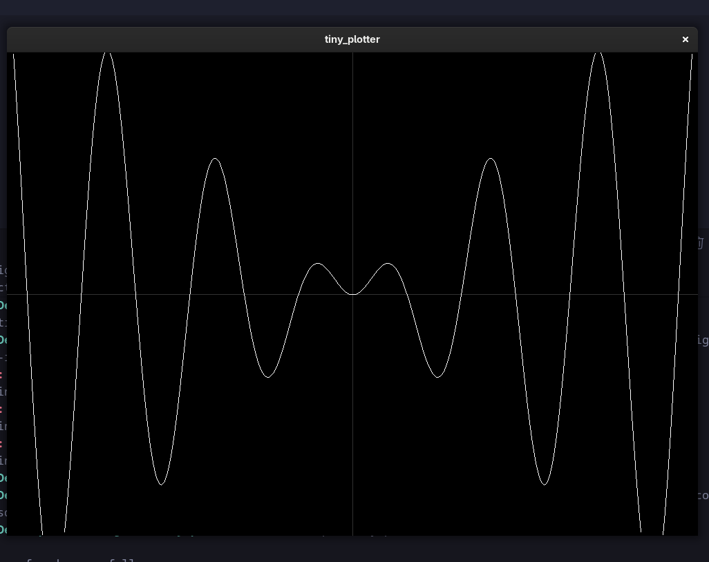

 tiny_plotter

**tiny_plotter** is a lightweight 2D function plotter written in C using **SDL3** and **tinyexpr**.
Some of the tinyexpr parsing content is customised.
It allows you to plot mathematical expressions interactively from the command line.

---

## Features

- Plot any valid expression of `x`, e.g., `sin(x)`, `x^2 + 3*x + 1`, `ln(x)`
- Smooth 2D plotting with axes
- Supports simple keyboard panning (W/A/S/D)
- Lightweight and portable C code

---

## Build Instructions
- on gcc "gcc src/main.c src/tiny_expr.c src/fun.c -o output/tiny_plotter $(pkg-config --cflags --libs sdl3 sdl3-image) -lm" would do the trick.
- the flags are explicitly mentioned, the build instructions are commented out in main.c as well.
- ./tiny_plotter "ln(x)" would open the window
- keep in mind SDL_Hint is explicitly commented out in fun, if you want to use it on a specific driver, please add it in game_init.

## Usage
- ./output/tiny_plotter "x^2 + 3*x + 1"
- ./output/tiny_plotter "sin(x)"
- ./output/tiny_plotter "ln(x)"
- WASD to move the axes.

## Screenshots

